# GelSlim 3.0

**Click on the pictures below for more information**

## Mechanical
| Elastomer | Fasteners | Body | Shaping Lens |
|---|---|---|---|
| <a href="  ">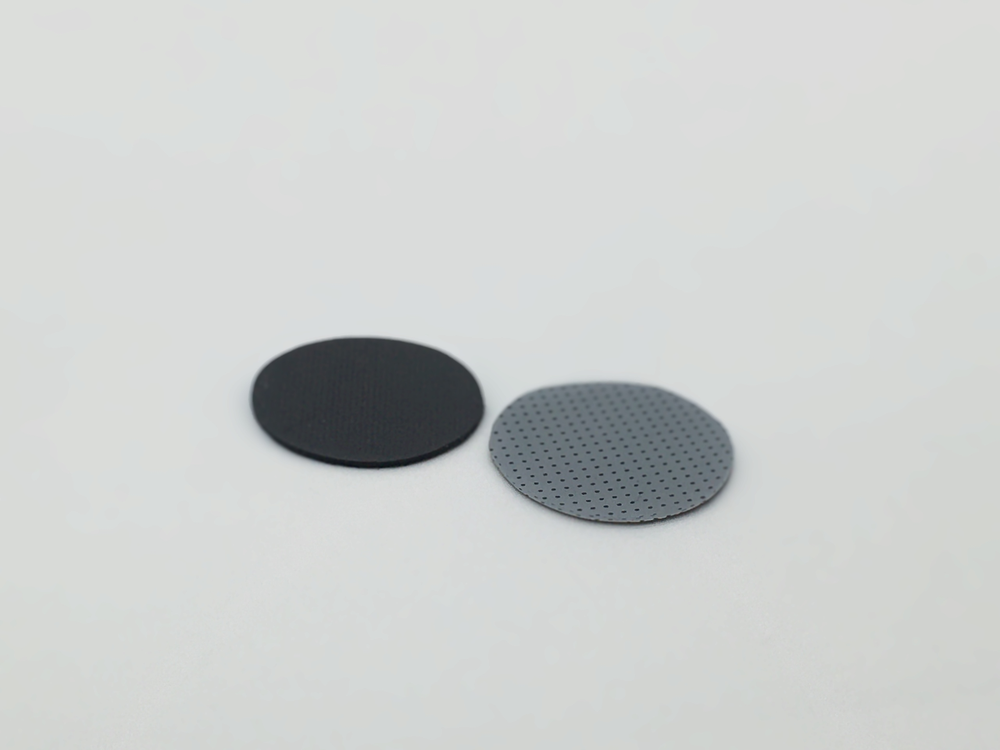</a>| | <a href="  ">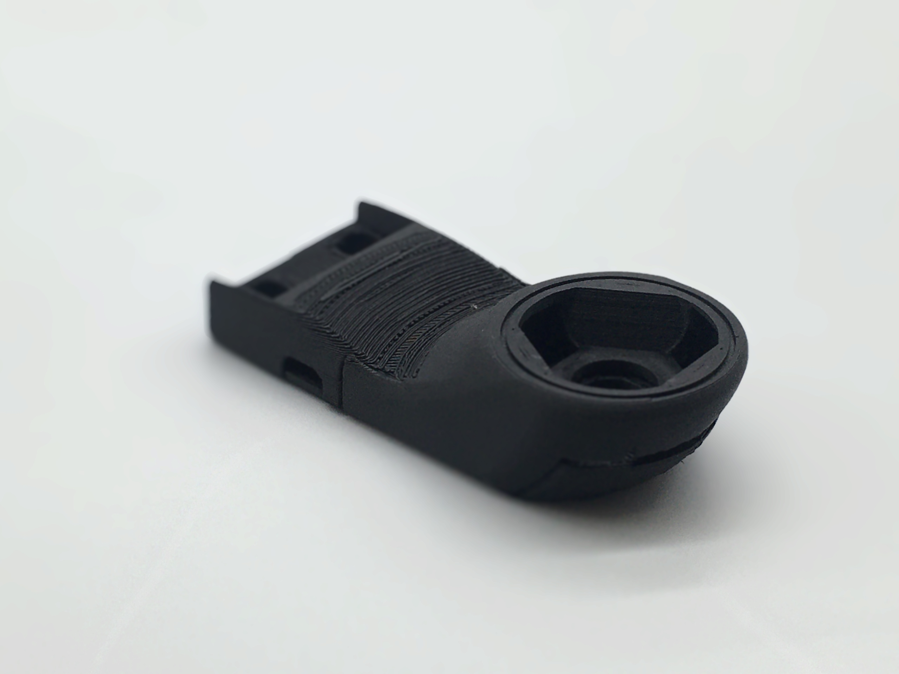</a>| <a href="  ">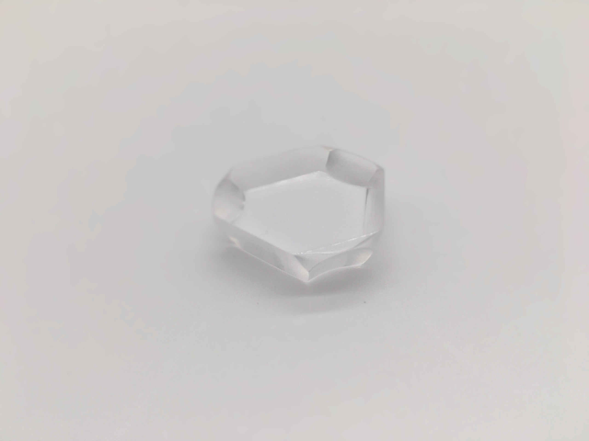</a>| 

## Electrical
| LED Driver | LED Harness | Camera | Connectors and Adapters |
|---|---|---|---|
| <a href="  ">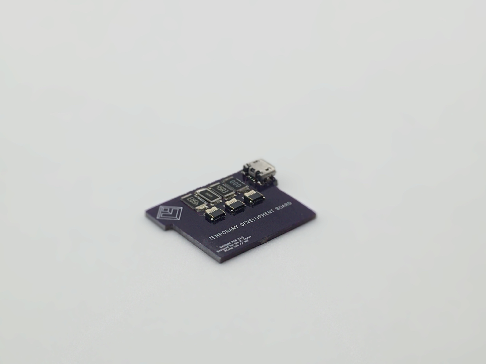</a>| <a href="  ">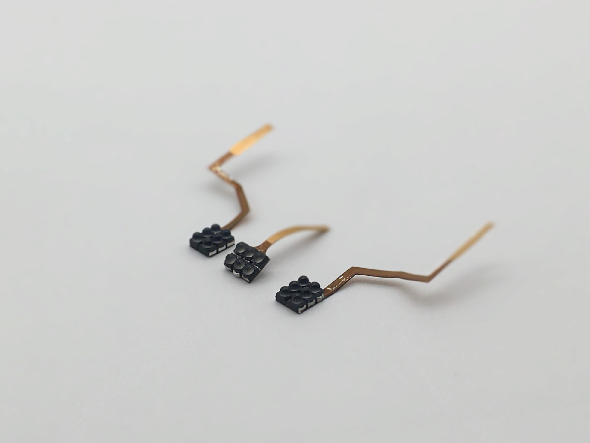</a>| <a href="  ">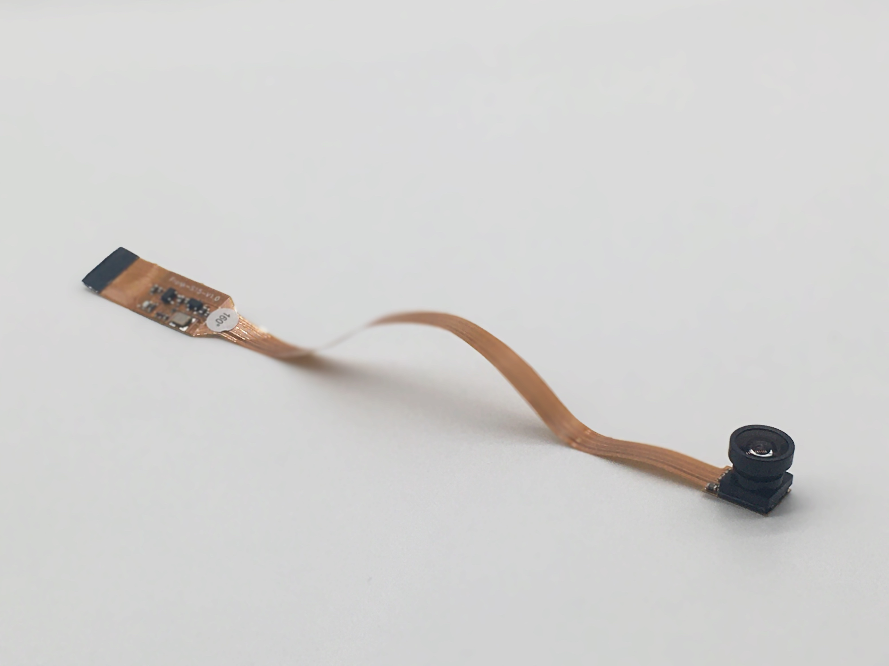</a>| <a href="  ">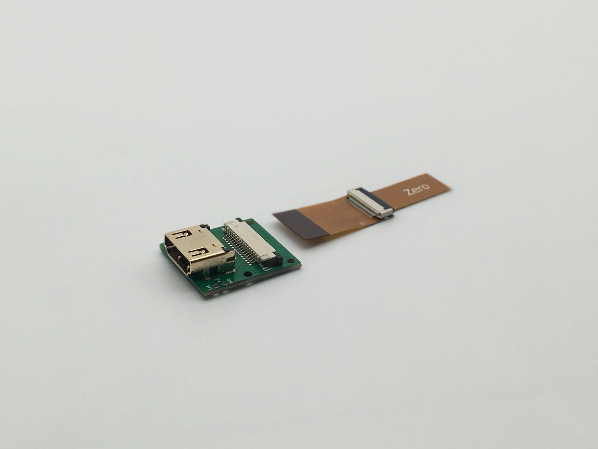</a>| 

## Software
| Raspberry Pi | Dependencies | GUI | Calibration |
|---|---|---|---|
| | | | <a href="  ">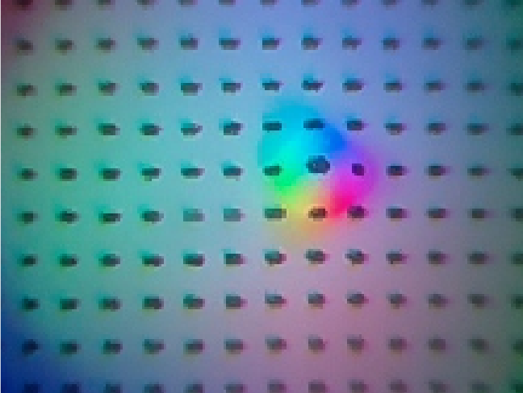</a>| 

## Step-by-Step Instructions
| 3-D Printing  | PCB Fabrication | Elastomer Fabrication | Assembly |
|---|---|---|---|
| <a href="  ">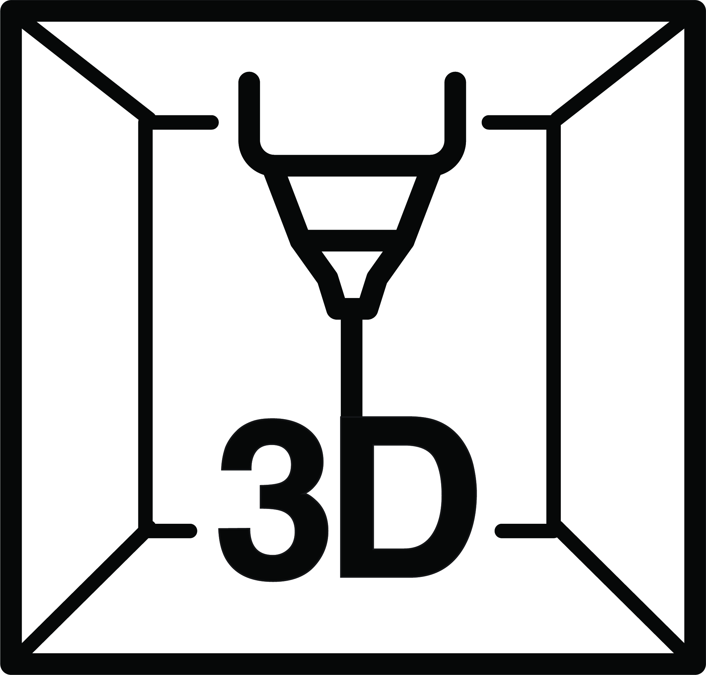</a>| <a href="  ">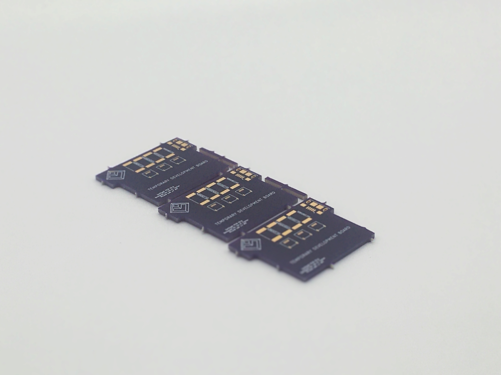</a>| <a href="  ">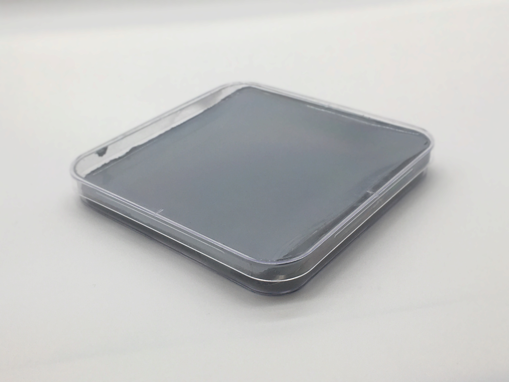</a>| <a href="  ">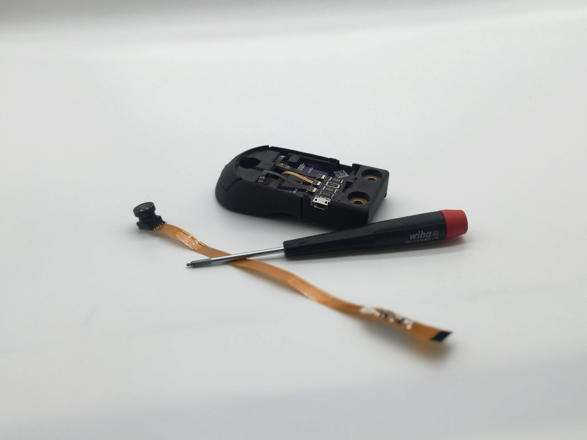</a>| 

## More Details
| Mechanical Tools and Consumables | Electronics Components and Tools | Known Issues |
|---|---|---|
| <a href="  ">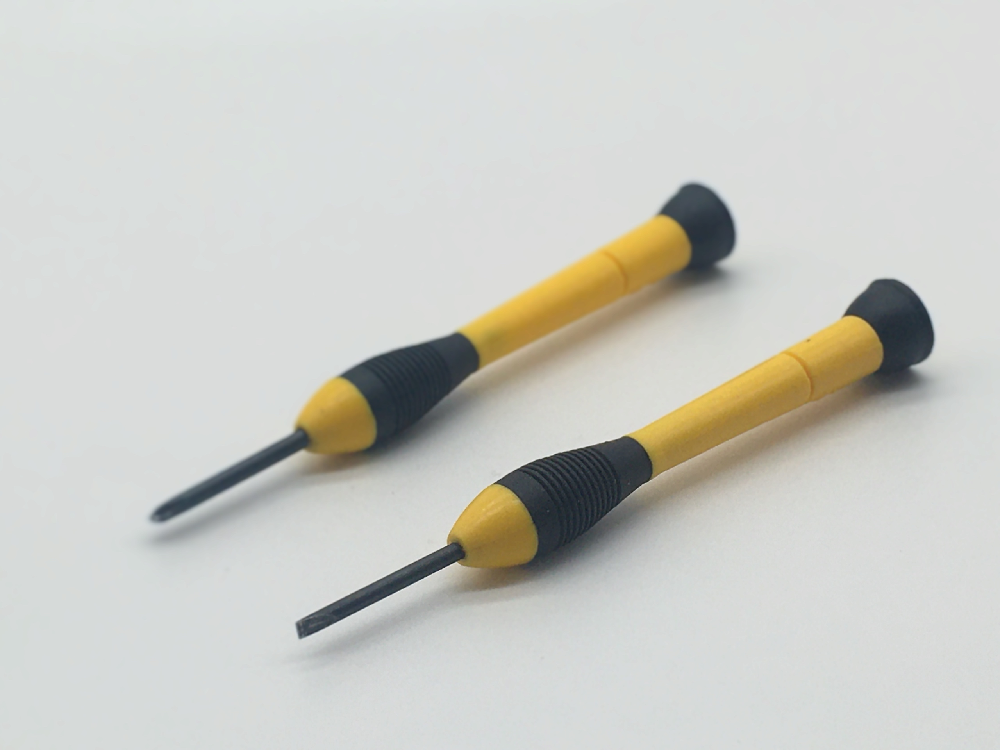</a>| <a href="  ">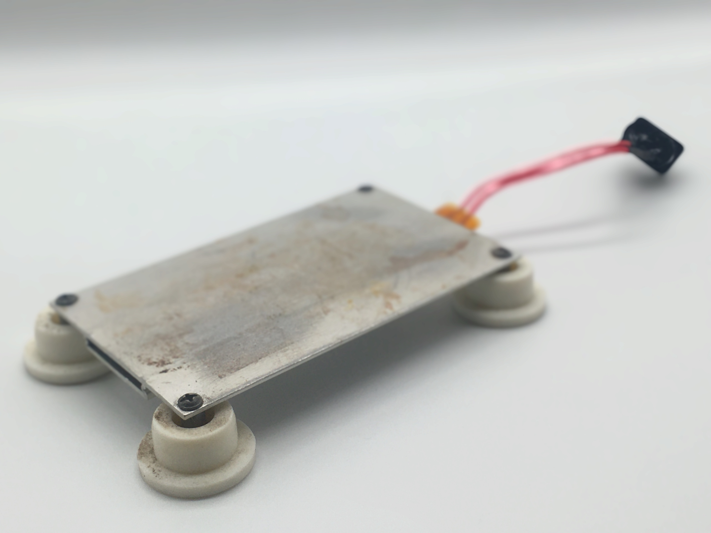</a>| | 

## More Information
[GelSlim 3.0 - Webpage](https://ianhtaylor.net/gelslim-30) 
[GelSlim 3.0 - Paper](https://arxiv.org/abs/2103.12269) 
[GelSlim 3.0 - Demo](https://www.youtube.com/watch?v=Y10XN9byO0g) 
[MCube Lab - YouTube Channel](https://www.youtube.com/channel/UCMYUWZTFWZjj7pUc3UPUjig)     

## Notice
This repo is under construction, the following files and folders are not present.
- /Simulation and Optimization/Results
- /Simulation and Optimization/Settings
- /Software/GUI 
  - Tangential Force Calculation
  - Normal Force Calculation

## Questions and Contributing
If you have questions or need help with the content of this repo please open a ticket. We welcome useful contributions to the repo -- if you want to contribute please read how to contribute. The MCube Manipulations and Mechanisms Lab also distributes pre-made sensors by mail upon request. Please direct all distribution inquiries to the following form https://forms.gle/MbcMEy3fS2nrsJG58.

## Authors
Ian Taylor

## License
These design files are licensed under CC-by-NC, as found in the [LICENSE](https://github.com/mcubelab/gelslim/blob/main/LICENSE) file.
