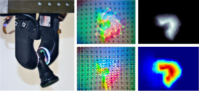

<!doctype md>
<link href="style.css" rel="stylesheet" type="text/css" />
<body>

    

        

            <h1> GelSlim 3.0</h1>
            <h3>An Open-Source Compact Tactile-Sensing Finger for the High-Resolution Measurement of Shape, Force and Slip </h3>
            

                
            

        

        

            <h2>Introduction</h2>
            

                This website is the entry point to the resources for the GelSlim tactile-sensing finger. 
            

            <h2>Videos</h2>
            

                <video width="390" controls>
                    <source src="gelslim.mp4" type="video/mp4">
                    Your browser does not support the video tag.
                </video>
                <video width="390" controls>
                    <source src="extrinsic.mp4" type="video/mp4">
                    Your browser does not support the video tag.
                </video>
                

                    More videos are available on our <a
                        href="https://www.youtube.com/channel/UCMYUWZTFWZjj7pUc3UPUjig">YouTube channel</a>.  
                

            

            <h2>Build your own sensor</h2>
            All the hardware and software has been open sourced under the CC-by-NC license so the sensors
            can easily be reproduced by other research laboratories. We also manufacture and deliver sensors upon <a href="https://forms.gle/GvABhS4cE3JDxKf59">request</a>.
            
All the sources are hosted on the <a href="https://github.com/mcubelab/gelslim">GelSlim Github site</a>

            <h2>End-Users</h2>
            
 We are proud to have provided GelSlim 3.0 sensors in collaboration with a variety of industry leading robotics research laboratories including: <a href="https://x.company/projects/everyday-robots/">The Everyday Robot Project - X</a>, <a href="https://www.merl.com/">Mistubishi Electric Research Labs</a>, <a href="https://global.abb/group/en">ABB Group</a> and <a href="https://www.magna.com/"> Magna International Inc.</a> If you are interested in collaborating please contact us at <a href = "mailto: themcubelab@gmail.com"> themcubelab@gmail.com</a>.
            

            <h2>Referencing the project</h2>
            You can reference the project with the following citation:  
            <em><small>@misc{gelslim}, 
                    title={GelSlim3.0: High-Resolution Measurement of Shape, Force and Slip in a Compact Tactile-Sensing Finger}, 
                    author={I. {Taylor} and S. {Dong} and A. {Rodriguez}}, 
                    year={2021}, 
                    arXiv = {arXiv:2103.12269}}  
                </small>
            </em>
            The pdf of the paper is available <a href="https://arxiv.org/pdf/2103.12269.pdf">here</a>

            

                
                <small>MCube Manipulations and Mechanisms Lab</small>
            

